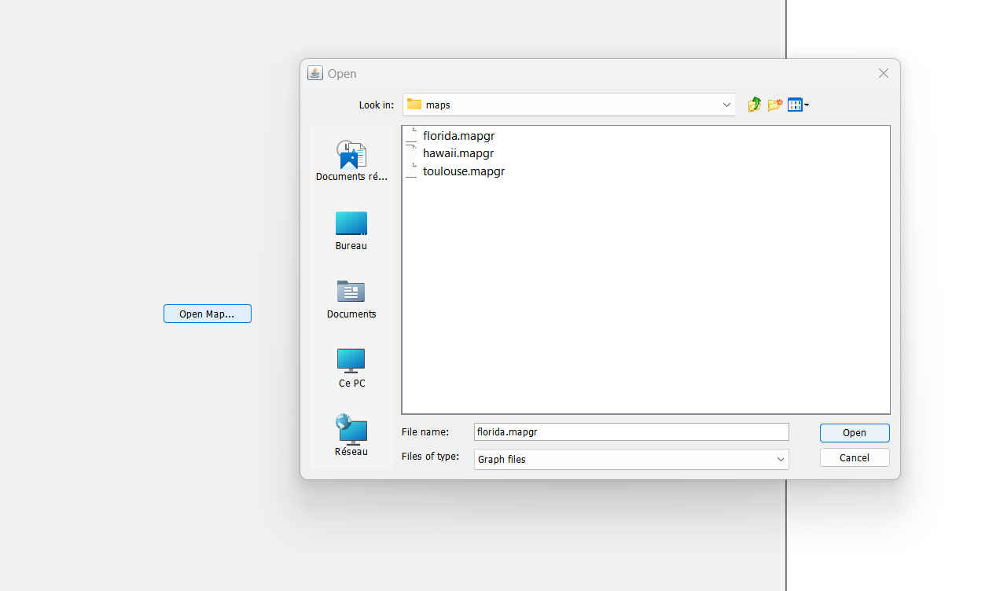
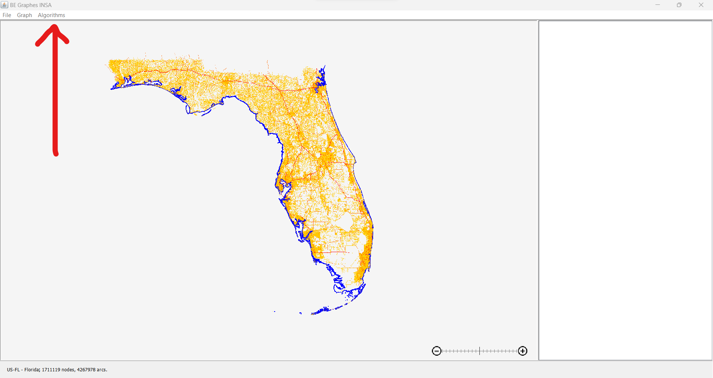
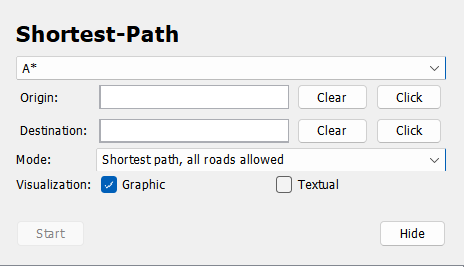
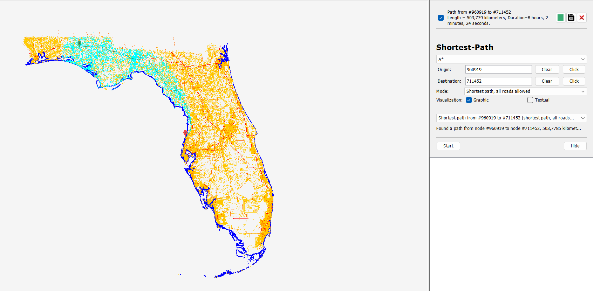

# Graph & Algorithm project &mdash; INSA Toulouse

### To run, run the Java file:
`be-graphes-gui\src\main\java\org\insa\graphs\gui\MainWindow.java`

### Once the GUI started you can open a map present in the maps folder.

### Then go to Algorithms on the top left of the screen and select Shortest-Path.

### You will see a module appear on the right of your screen. Then you can select on the top list the algorithm that you want (Bellman-Ford, Dijkstra, A*).

### Once the Algorithm selected. You can place in the map, the initial and destination points and then press Start in the right module.

Now you can see the progression of the Algorithm in blue and the Shortest Path in a different color. Some stats of the path will be shown on the top of the module.

## Autors : 

Marti JIMENEZ, Rémi JACQUEMIN
